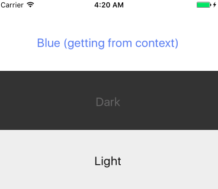

# React & React Native Theme Manager

Goal: Make it easier to support multiple themes in an app (e.g `light` and `dark`).

-- Contributions are welcome!

## Install

```sh
$ npm i -S react-native-theme-manager
```

### Features (implemented)
 - [x] Change component theme using `theme` prop
 - [x] Get theme from parent components using `theme` context

### TODOs (under development)
 - [ ] Support variables inside themes
 - [ ] Performance optimization (memoize styles creation)


### Example



You can copy and paste both files below for a fully working example:

`App.js`
```js
import React, { Component } from 'react';
import { AppRegistry, View } from 'react-native';
import ThemeManager, { themable } from 'react-native-theme-manager';

import Button from './src/components/Button';
const ThemableView = themable(View);

export default App = () => (
  <ThemableView style={{ flex: 1, paddingTop: 22 }} theme='blue'>
    <Button>Blue (getting from context)</Button>
    <Button theme='dark'>Dark</Button>
    <Button theme='light'>Light</Button>
  </ThemableView>
);

AppRegistry.registerComponent('yourPackageName', () => App);
```

`src/Button.js`
```js
import React, { Component } from 'react';
import { Text, View } from 'react-native';
import ThemeManager from 'react-native-theme-manager';

const Button = (props, context) => {
  // if you are not using a pure funciton,
  // you access the theme via this.context.theme
  themeManager.setTheme(context.theme);
  const { styles } = themeManager;

  return (
    <View style={styles.view}>
      <Text style={styles.text}>{props.children}</Text>
    </View>
  );
}

const themeManager = new ThemeManager();

themeManager.create({
  view: { height: 100 },
  text: { fontSize: 20, textAlign: 'center', marginTop: 40 }
});

themeManager.create('light', {
  view: { backgroundColor: '#eeeeee' },
  text: { color: '#111111' },
});

themeManager.create('dark', {
  view: { backgroundColor: '#333333' },
  text: { color: '#666666' },
});

themeManager.create('blue', {
  text: { color: '#5685ee' },
});

export default themeManager.attach(Button);

```


#### Developer
- Full Stack Developer (Node.js, GraphQL, React, React Native)
- Twitter: [@brunolemos](https://twitter.com/brunolemos)

#### License
- MIT
